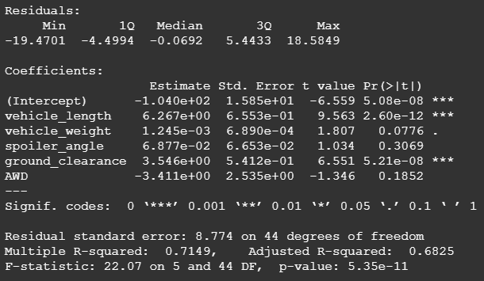
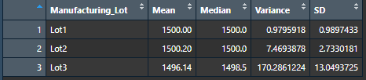
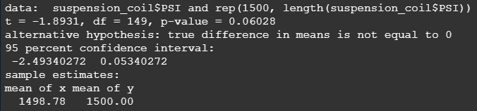
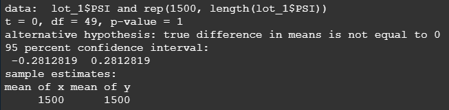
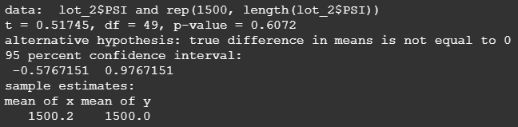
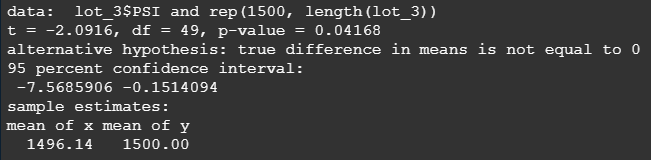

# MechaCar_Statistical_Analysis

## Linear Regression to Predict MPG

The Pr(>|t|) values for vehicle length and ground clearance are both well below our 0.05 significance level, and provide a non-random amount of variance to the mpg values in the dataset.

The slope of the linear model is not zero. The two significant variable fits have positive slope estimates.

This linear model predicts MPG of MechaChar prototypes effectively because the p-value is much lower than our 0.05 significance level.

## Summary Statistics on Suspension Coils

In total, the current manufacturing data meets the design specifications requiring the variance to be below 100 pounds per square inch.

However, only lots 1 and 2 meet the design specifications individually. Lot 3 does not meet the requirements because the variance of about 170 pounds per square inch exceeds the threshold of 100 pounds per square inch.

## T-Teests on Suspension Coils

In the case of the total distribution of PSI across the sample, the t-test resulted in a p-value of 0.06 which does not meet our 0.05 significance level. The mean of the distribution is not different enough to reject the null hypothesis.

In the case of Lot1's distribution of PSI across the sample, the t-test resulted in a p-value of 1, which does not meet our 0.05 significance level. The difference in means between the distribution and the population mean is zero, which supports the null hypothesis.

In the case of Lot1's distribution of PSI across the sample, the t-test resulted in a p-value of 0.6, which does not meet our 0.05 significance level. The means of the distribution and the population are not different enough to reject the null hypothesis.

In the case of Lot3's distribution of PSI across the sample, the t-test resulted in a p-value of 0.04, which meets our 0.05 significance level. The mean of Lot3's distribution and the population mean are different enough to reject the null hypothesis.

## Study Design: MechaCar vs Competition

To quantify how the MechaCar performs against the competition, we will quantify performance by evaluating the difference in means of the horse power metric.

The null hypothesis is that there is no difference in the means of horsepower between the two samples.

A t-test will be used to determine if we are able to reject the null hypothesis within our 0.05 significance level.

To successfully run this test, the distributions of horse power for each of the MechaCar and each of its competitor's populations.